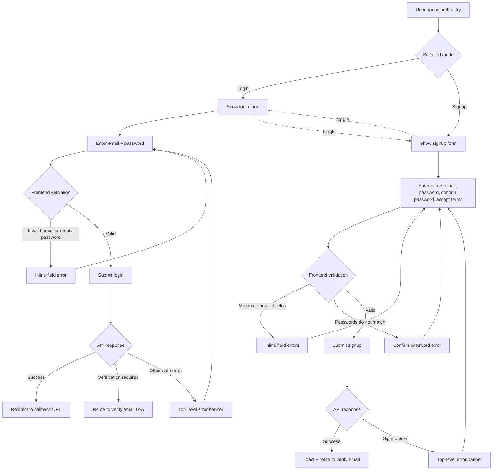

# Unified Login and Create Account Flow

This document captures the updated frontend-only auth entry experience.

## Goals

- Use one shared entry surface for both login and signup
- Reduce first-time-user friction with a visible mode toggle
- Keep validation feedback inline and immediate
- Preserve existing callback redirects without backend changes

## Entry Points

- Primary route: `/login`
- Signup mode: `/login?mode=signup`
- Compatibility alias: `/register` immediately resolves into signup mode on the unified page

## Flow Diagram

## Interaction Notes

- Users can switch between login and signup without leaving the page.
- Mode changes update the URL so links remain shareable and callback-safe.
- Password inputs support show/hide toggles in both modes.
- Verified-email return flow lands back on the unified page in login mode.

## Error States Covered

- Missing required input
- Invalid email format
- Password too short during signup
- Password and confirm-password mismatch
- Terms not accepted during signup
- API-driven login or signup errors surfaced in a banner
- Verification-required login redirected into email verification
